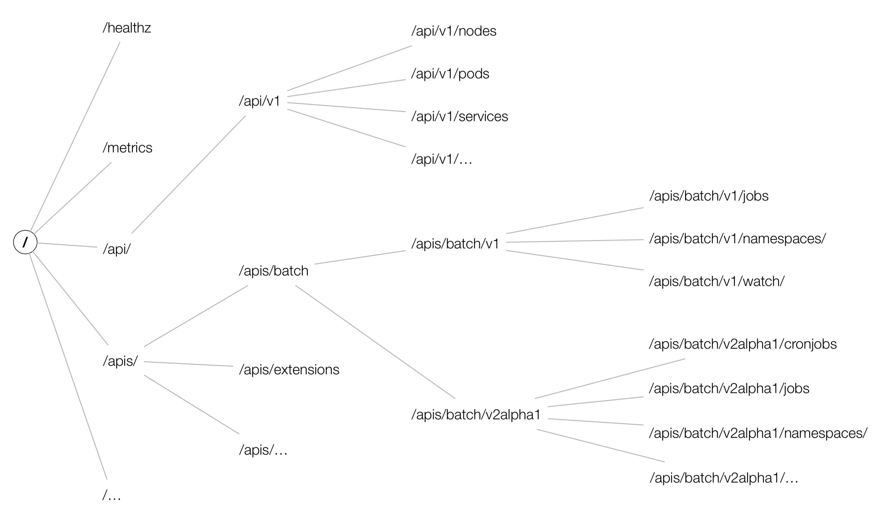
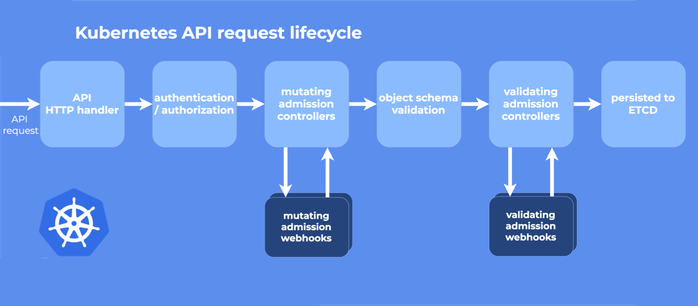

# kubernetes api

## 版本

Alpha：默认情况下是禁用的，并且可以随时对功能删除。

Beta：默认情况下是启用的，并且代码已经经过了很好的测试，可能会对某些功能进行更改和删除。

稳定级别，例如 v1 下的资源就已经是稳定版本，会出现在之后的多个版本中。

## apiServer路径



因为历史原因，才会有 api/v1 组下面的资源并不在 apis/core 路径下，因为刚开始开发代码可能不会考虑的很周全。之后诞生的资源访问时都是通过 apis/batch/v1 这种方式访问。

可以使用 `kubectl explain <resources>` 查看某个资源所属 GroupVersion，之后组成 URL 后可以看到可以查询和操作不同实体的几何。

```sh
# 看到所有操作的路径
root@k8s-master1:~# kubectl get --raw /

# 看到 Version 为 apps/v1
root@k8s-master1:~# kubectl explain deployment
KIND:     Deployment
VERSION:  apps/v1

DESCRIPTION:
     Deployment enables declarative updates for Pods and ReplicaSets.

FIELDS:
   apiVersion   <string>
# 组成 URL 并访问
root@k8s-master1:~# kubectl get --raw /apis/apps/v1 |jq
```

上面的这种方式是使用 `kubectl get --raw` 来发送 http 请求，也可以使用 `kubectl proxy` 代理后发送请求。

```sh
root@k8s-master1:~# kubectl proxy
root@k8s-master1:~# curl 127.0.0.1:8001/apis/apps/v1/
```

k8s REST FUL 风格的动作请求方式为标准的 HTTP 请求，POST PUT GET DELETE PATCH 对应 创建 更新 查看 删除 局部修改。

## Resource 和 Kind 的区别

Resource 指的是 HTTP Restful API 请求路径中的资源，而 Kind 对应的是系统中真正的实体，Kind 对应的可以理解为是程序中的结构体对象。

Kind 与 Resource 之间是相互关联的，并且通过 GVK 进行标识，GVK 通过 GVR 标识的 HTTP 路径提供服务，将 GVK 映射到 GVR 的过程就叫做 REST mapping。

GVK 通过 GVR 标识的 HTTP 路径提供服务，可以将 GVR 中的服务提供理解为 `http.Handler` 方法，绑定某个 URL 到服务器之上。

YAML 文件中的资源清单是定义的 GVK，apiServer 将其转换为对应的 GVR 响应用户通过 GVK 的请求。

## APIServer的请求



- HTTP 请求先由 DefaultBuildHandlerChain() 注册的一系列过滤器处理 , 这个函数位于[k8s.io/apiserver/pkg/server/config.go](https://github.com/kubernetes/kubernetes/blob/66674f549626cc41f04e475d2c0e865116c4cd40/staging/src/k8s.io/apiserver/pkg/server/config.go#L543) 文件中，它对请求进行一系列过滤操作，经过验证的就返回相应 HTTP 返回码
- 接下来根据请求的路径，通过 handler 路由到各种程序中 [k8s.io/apiserver/pkg/server/handler.go](https://github.com/kubernetes/kubernetes/blob/66674f549626cc41f04e475d2c0e865116c4cd40/staging/src/k8s.io/apiserver/pkg/server/handler.go#L42:6)
- 每个 API Group 都注册了一个 handler , 详情参见[k8s.io/apiserver/pkg/endpoints/groupversion.go](https://github.com/kubernetes/kubernetes/blob/66674f549626cc41f04e475d2c0e865116c4cd40/staging/src/k8s.io/apiserver/pkg/endpoints/groupversion.go#L99)和 [k8s.io/apiserver/pkg/endpoints/installer.go](https://github.com/kubernetes/kubernetes/blob/66674f549626cc41f04e475d2c0e865116c4cd40/staging/src/k8s.io/apiserver/pkg/endpoints/installer.go#L183) 它接受 HTTP 请求和上下文，并从 etcd 中检索和传递请求的对象进行数据处理。

# Schema

为什么要自动生成 DeepCopyObejct 方法，该方法的作用是将 Schema 注册称为 Object 接口，实际上我们所有的操作都会操作 Object 接口，并不是直接操作资源本身，即必须要实现 Object 接口。

实现 Object 需要实现两个方法，其中一个方法已经在 Type.Metadata 中实现了，另一个则需要自动工具 `deepcopy-gen` 自动生成。

register.go 中实现的 AddToScheme 函数主要实现的功能是将我们各种的资源类型注册到 ClientSet 中去。

runtime.NewScheme 创建一个全新的 Scheme

## Deployment Scheme

`kubernetes/staging/src/k8s.io/api/apps/v1/` 路径中内容

`types.go` 文件，该文件主要作用就是描述了资源对象的模型。

```go
// 这个结构体中定义着 Deployment 的 yaml 定义字段
type Deployment struct {
	metav1.TypeMeta `json:",inline"`
    // 其中定义着 Kind 和 Apiserver 的存储
	// type TypeMeta struct {
    
	metav1.ObjectMeta `json:"metadata,omitempty" protobuf:"bytes,1,opt,name=metadata"`
    // 该结构体中定义着 metadata 的内容
    // type ObjectMeta struct {
    
	Spec DeploymentSpec `json:"spec,omitempty" protobuf:"bytes,2,opt,name=spec"`
	// 该结构体中定义着 Deployment 结构体的内容
    
	Status DeploymentStatus `json:"status,omitempty" protobuf:"bytes,3,opt,name=status"`
    // 该结构体中定义着 Status 状态信息，是其他状态的集合，但是是自动更新
}
```

`register.go` 将各种类型注册到 ClientSet 的 Scheme 中，该文件的作用就是定义了一个 `AddToScheme` 对外开放的函数。这种方法的作用就是将自己的各种资源类型注册到 Scheme 中。

deploymentScheme文件

```go
var (
	// TODO: move SchemeBuilder with zz_generated.deepcopy.go to k8s.io/api.
	// localSchemeBuilder and AddToScheme will stay in k8s.io/kubernetes.
	SchemeBuilder      = runtime.NewSchemeBuilder(addKnownTypes)
	localSchemeBuilder = &SchemeBuilder
	AddToScheme        = localSchemeBuilder.AddToScheme
)

func addKnownTypes(scheme *runtime.Scheme) error {
	scheme.AddKnownTypes(SchemeGroupVersion,
		&Deployment{},
		&DeploymentList{},
		&StatefulSet{},
		&StatefulSetList{},
		&DaemonSet{},
		&DaemonSetList{},
		&ReplicaSet{},
		&ReplicaSetList{},
		&ControllerRevision{},
		&ControllerRevisionList{},
	)
	metav1.AddToGroupVersion(scheme, SchemeGroupVersion)
	return nil
}
```

总 Register.go 文件

```go
var Scheme = runtime.NewScheme()
var Codecs = serializer.NewCodecFactory(Scheme)
var ParameterCodec = runtime.NewParameterCodec(Scheme)
var localSchemeBuilder = runtime.SchemeBuilder{
......
	certificatesv1beta1.AddToScheme,
	coordinationv1beta1.AddToScheme,
	coordinationv1.AddToScheme,
	corev1.AddToScheme,
	discoveryv1.AddToScheme,
	discoveryv1beta1.AddToScheme,
	eventsv1.AddToScheme,
	eventsv1beta1.AddToScheme,
	extensionsv1beta1.AddToScheme,
	flowcontrolv1alpha1.AddToScheme,
	flowcontrolv1beta1.AddToScheme,
	networkingv1.AddToScheme,
......
}
```

`zz_generated.deepcopy.go` 使用 `deepcopy-gen` 命令统一生成。所有注册到 Scheme 的资源类型都要实现 runtime.Object 接口，该接口的定义为：

```go
type Object interface {
	GetObjectKind() schema.ObjectKind
	DeepCopyObject() Object
}
```

看看deployment 是否已经实现

```go
默认情况已经包含 metav1.Typemeta，该结构体下包含 GetObjectKind 方法，也就代表默认已经实现一个方法。
另一个方法就需要通过 deepcopy-gen 工具实现，需要添加 `+k8s:deepcopy-gen:interfaces=k8s.io/apimachinery/pkg/runtime.Object` 注释。
添加该注释后，deepcopy-gen 工具会自动在 zz_generated.deepcopy.go 文件中生成 DeepCopyObject 方法：
func (in *Deployment) DeepCopyObject() runtime.Object {
	if c := in.DeepCopy(); c != nil {
		return c
	}
	return nil
}
```

# ClientSet

用来操作集群内部资源，list delete create update 等操作。

分为 kubeconfig 和 incluster 两种方式。

kubeconfig 就是使用 kubeconfig 文件进行访问。

incluster 方式是使用内部的集群网路，根据 default 名称空间下的 kubernetes service，访问到集群外部的 apiserver 从而实现查询。

## 使用范例

```go
package main

import (
	"context"
	"flag"
	"fmt"
	"os"
	"path/filepath"

	metav1 "k8s.io/apimachinery/pkg/apis/meta/v1"
	"k8s.io/client-go/kubernetes"
	"k8s.io/client-go/rest"
	"k8s.io/client-go/tools/clientcmd"
)

func main() {
	var kubeconfig *string
	var config *rest.Config
	var clientset *kubernetes.Clientset
	if home := homeDir(); home != "" {
		kubeconfig = flag.String("kubeconfig", filepath.Join(home, ".kube", "config"), "(默认为家目录下的config文件)")
	} else {
		kubeconfig = flag.String("kubeconfig", "", "必须设置")
	}
	fmt.Println("run inclusterconfig...")
	config, err := rest.InClusterConfig()
	if err != nil {
		config, err = clientcmd.BuildConfigFromFlags("", *kubeconfig)
		if err != nil {
			panic(err)
		}
	}

	fmt.Println("run kubernetes conn...")
	clientset, err = kubernetes.NewForConfig(config)
	if err != nil {
		panic(err)
	}

	fmt.Println("run kubernetes pod list...")
	// podlist, err := clientset.CoreV1().Pods("default").List(context.Background(), metav1.ListOptions{})
	podlist, err := clientset.AppsV1().Deployments("kube-system").List(context.TODO(), metav1.ListOptions{})
	if err != nil {
		panic(err)
	}
	for i, v := range podlist.Items {
		fmt.Println("......start")
		fmt.Println(i, "--->", v.Name)
	}
	fmt.Println("......end")
}

func homeDir() string {
	if h := os.Getenv("HOME"); h != "" {
		return h
	}
	return ""
}
```

## ClientSet源码

实际上在每个资源下都会有不同的 ClientSet，但是最终会注册到总的 ClientSet。

NewForConfig 返回 ClientSent 实际上是通过每个 group version 内部自己的 NewForConfig 实现的

```go
// k8s.io/client-go/kubernetes/clientset.go
func NewForConfig(c *rest.Config) (*Clientset, error) {
	configShallowCopy := *c
	if configShallowCopy.RateLimiter == nil && configShallowCopy.QPS > 0 {
		if configShallowCopy.Burst <= 0 {
			return nil, fmt.Errorf("burst is required to be greater than 0 when RateLimiter is not set and QPS is set to greater than 0")
		}
		configShallowCopy.RateLimiter = flowcontrol.NewTokenBucketRateLimiter(configShallowCopy.QPS, configShallowCopy.Burst)
	}
	var cs Clientset
	var err error
    // 调用 appsv1.NewForConfig 函数，最终会返回 cs 结构体
	cs.appsV1, err = appsv1.NewForConfig(&configShallowCopy)
	if err != nil {
		return nil, err
	}
	return &cs, nil
}
```

appsv1.NewForConfig 函数中其中调用了 RESTClientFor 函数。

```go
// k8s.io/client-go/kubernetes/typed/apps/v1/apps_client.go
func NewForConfig(c *rest.Config) (*AppsV1Client, error) {
	config := *c
    // 定义默认值
	if err := setConfigDefaults(&config); err != nil {
		return nil, err
	}
    // RESTClientFor 函数作用是格式化 rest.Config 结构体中的数据，并发起 http 请求
	client, err := rest.RESTClientFor(&config)
	if err != nil {
		return nil, err
	}
	return &AppsV1Client{client}, nil
}


func setConfigDefaults(config *rest.Config) error {
    // 定义默认的 scheme
	gv := v1.SchemeGroupVersion
	config.GroupVersion = &gv
    // 定义根访问的 api 核心组
	config.APIPath = "/apis"
	config.NegotiatedSerializer = scheme.Codecs.WithoutConversion()

	if config.UserAgent == "" {
		config.UserAgent = rest.DefaultKubernetesUserAgent()
	}

	return nil
}
```

RESTClientFor 函数，格式化数据，生成 URL 并调用 NewRESTClient 返回完成的 RESTClient 请求结构体。

> RESTClient 可以调用所属于 RESTFUL 风格的请求方法，例如 GET PUT POST DELETE 等方法
>
> 实现这几种的方法，是使用 ClientSet 中的 NewDeployment 方法实现的返回 DeploymentInterface 实现。

```go
// k8s.io/client-go/rest/config.go
func RESTClientFor(config *Config) (*RESTClient, error) {
    // NewRESTClient 创建 RESTFUL 结构体
	restClient, err := NewRESTClient(baseURL, versionedAPIPath, clientContent, rateLimiter, httpClient)
	if err == nil && config.WarningHandler != nil {
		restClient.warningHandler = config.WarningHandler
	}
	return restClient, err
}
```

NewRESTClient 函数，NewRESTClient 函数会生成用于 RESTFul 风格使用的 RESTClient 结构体。

```go
func NewRESTClient(baseURL *url.URL, versionedAPIPath string, config ClientContentConfig, rateLimiter flowcontrol.RateLimiter, client *http.Client) (*RESTClient, error) {
	if len(config.ContentType) == 0 {
		config.ContentType = "application/json"
	}

	base := *baseURL
	if !strings.HasSuffix(base.Path, "/") {
		base.Path += "/"
	}
	base.RawQuery = ""
	base.Fragment = ""

    // 返回 RESTClient 结构体
	return &RESTClient{
		base:             &base,
		versionedAPIPath: versionedAPIPath,
		content:          config,
		createBackoffMgr: readExpBackoffConfig,
		rateLimiter:      rateLimiter,

		Client: client,
	}, nil
}
```

clientset 调用对象内容的历程

```go
// 经历以下步骤
clientset.appv1.deployment("namespace").Get()

// clientset 结构体
type Clientset struct {
	appsv1 *appsv1.AppsV1Client
}

// 嵌套中的结构体内部封装了 rest.Interface 接口
type AppsV1Client struct {
	restClient rest.Interface
}

// Deployment 方法，实现的返回 Deployment 对象
func (c *AppsV1Client) Deployments(namespace string) DeploymentInterface {
	return newDeployments(c, namespace)
}

// newDeployment 函数，返回 deployment 实体对象
func newDeployments(c *AppsV1Client, namespace string) *deployments {
	return &deployments{
	// 将 NewRESTClient 创建的 RESTClient 赋值到 client 中
		client: c.RESTClient(),
		ns:     namespace,
	}
}

// deployments 的对象定义
type deployments struct {
	client rest.Interface
	ns     string
}

// 接口内容
type rest.Interface interface {
	GetRateLimiter() flowcontrol.RateLimiter
	Verb(verb string) *Request
	Post() *Request
	Put() *Request
	Patch(pt types.PatchType) *Request
	Get() *Request
	Delete() *Request
	APIVersion() schema.GroupVersion
}

// deployment 实现了 restInterface 接口
func (c *deployments) Get(ctx context.Context, name string, options metav1.GetOptions) (result *v1.Deployment, err error) {
	result = &v1.Deployment{}
	err = c.client.Get().
		Namespace(c.ns).
		Resource("deployments").
		Name(name).
		VersionedParams(&options, scheme.ParameterCodec).
		Do(ctx).
		Into(result)
	return
}
```


