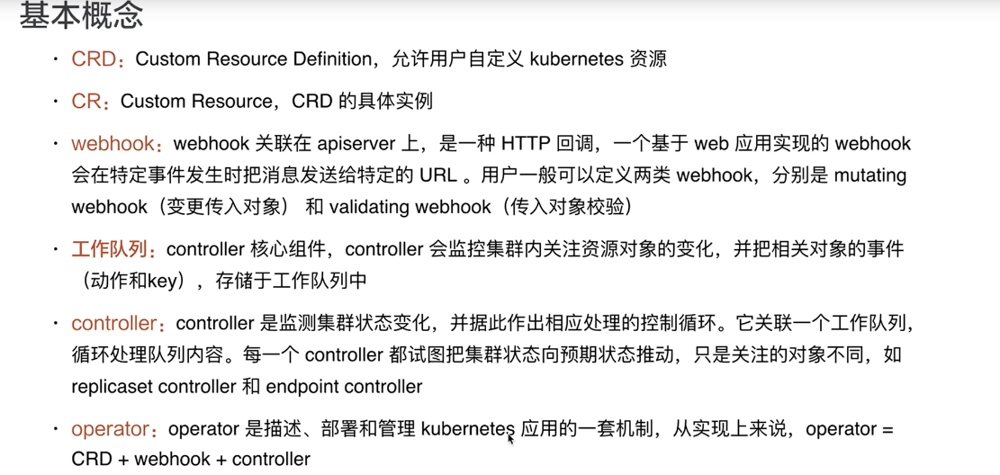
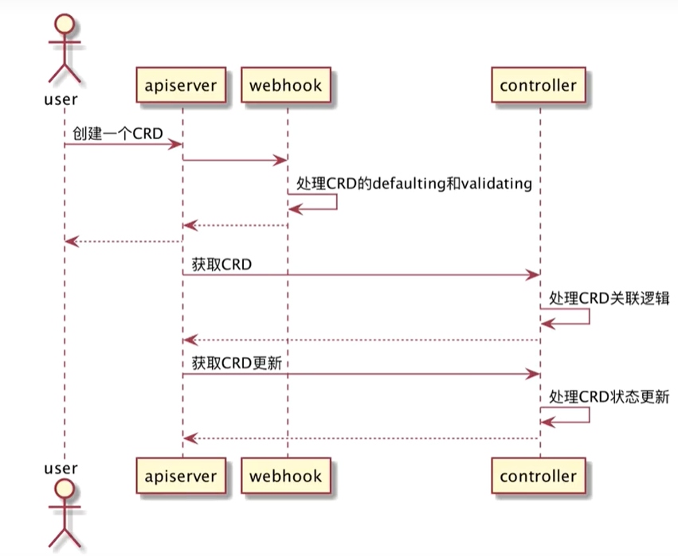

# 概念

## CRD/CR介绍

Custom Resource Definition：允许用户自定义 Kubernetes 资源。

Custom Resource：自定义资源，是 CRD 定义完成后实现的实例，称为 CR。

因为在 k8s 内部通常会对内部运行的资源进行抽象，并抽象成对应 API 接口，让用户仅仅可以只是用 yaml 文件来调用即可，不需要手工创建 Pod deployment 或者是 statefulset 方式进行组建。

## 扩展Kubernetes API方式

### 聚合层扩展

通过重新创建一个 apiserver 的方式扩展，然后让两个 apiserver 之间相互通信，相互通信的协调是由 kube-aggregator 实现的。

###  通过 CRD 创建自定义资源

#### CR介绍

是对 Kubernetes API 的扩展，可以使用动态注册的方式再运行中的集群出现或者是小时，集群管理员也可以独立于集群更新定制资源。

用户可以使用 kubectl 创建和访问其中的对象，就像是 Pods 这种内置资源一样。

#### Custom Controller

Custom Resource 只是用来作为存储结构化的数据，需要将 Custom Resource 与 Custom Controller 结合到一起时，那么 Custom Resource 创建出的资源才可以有实质性的工作作用。

使用声明式 API 可以设定资源的期望状态，并尝试让 Kubernetes 对象的当前状态同步到期望状态。控制器就会将结构化的数据解释为用户期望的记录，并且会持续地维护该状态。

operator 模式实际上就是将 Custom Controller 和 Custom Resource 结合到一起的。

## apiServer二次开发

直接将 api server 进行二次开发，并对接到默认的 apiserver 上，难度较高，并且没有办法与 k8s 的不同版本相结合。

# CRD开发

## CRD介绍

CRD 可以称为元数据，是用户通过 CR 定义出的格式化内容，通过 CRD 的格式保存到 etcd 中。CRD 对应的 controller 会自动的读取 etcd 中格式化内容，并同步到 apiserver 中持续校准。

```go
for {
    desired := getDesiredState()   // 获取资源对象的期望状态
    current := getCurrentState()   // 获取当前的实际状态
    makeChanges(desired,current)   // 执行操作，让当前的状态符合期望状态
                                   // 这一部分是体现运维工程师经验的地方
}
```

Operator 模式就是将 Custom Reousrce Definition 和 Controller 结合到一起，达到通过 kubernetes 中的声明式 API 可以创建出资源并实现相应功能。

## CustomResourceDefinition yaml格式

```yaml
apiVersion: apiextensions.k8s.io/v1  # API群组和版本
kind: CustomResourceDefinition  # 资源类别
metadata:
  name <string>  # 资源名称
spec:
    conversion <Object>  # 定义不同版本间的格式转换方式
       trategy <string>  # 不同版本间的自定义资源转换策略，有None和Webhook两种取值
       webhook <Object>  # 如何调用用于进行格式转换的webhook
    group <string>  # 资源所属的API群组
    names <Object>  # 自定义资源的类型，即该CRD创建资源规范时使用的kind
      categories  <[]string>  # 资源所属的类别编目，例如”kubectl get all”中的all
      kind <string>  # kind名称，必选字段
      listKind <string>  # 资源列表名称，默认为"`kind`List"
      plural <string>  # 复数，用于API路径`/apis/<group>/<version>/.../<plural>`
      shortNames <[]string>  # 该资源的kind的缩写格式
      singular <string>  # 资源kind的单数形式，必须使用全小写字母，默认为小写的kind名称
    preserveUnknownFields <boolean>  # 预留的非知名字段，kind等都是知名的预留字段
    scope <string>  # 作用域，可用值为Cluster和Namespaced
    versions <[]Object>  # 版本号定义
      additionalPrinterColumns <[]Object>  # 需要返回的额外信息
      name <string>  # 形如vM[alphaN|betaN]格式的版本名称，例如v1或v1alpha2等
      schema <Object>  # 该资源的数据格式（schema）定义，必选字段
        openAPIV3Schema  <Object>  # 用于校验字段的schema对象，格式请参考相关手册
      served <boolean>  # 是否允许通过RESTful API调度该版本，必选字段
      storage <boolean>  # 将自定义资源存储于etcd中时是不是使用该版本
      subresources <Object>  # 子资源定义
        scale <Object>  # 启用scale子资源，通过autoscaling/v1.Scale发送负荷
        status <map[string]>   # 启用status子资源，为资源生成/status端点
```

### 声明范例

```yaml
apiVersion: apiextensions.k8s.io/v1
kind: CustomResourceDefinition        #指定为 CRD 类型
metadata:
# 声明资源名称，
  name: users.auth.ilinux.io
spec:
# 声明资源组
  group: auth.ilinux.io
  names:
    kind: User        #kind 字段的名称，也就是资源名称
    plural: users        #复数标识
    singular: user        #单数标识
    shortNames:        #指定简写
    - u
  scope: Namespaced        #作用域，分为 Cluster 和 Namespace
  versions:        #指定版本
  - served: true    #是否通过 RESTful 来定义调度
    storage: true    #将自定义资源存储到 etcd 中是否使用此资源名称
    name: v1alpha1        #资源版本名称
    schema:    #数据格式的定义名称
      openAPIV3Schema:        #校验 schema 模式
        type: object    #定义的类型
        properties:    #属性定义
        #定义创建的属性类型的数值是数组类型还是字符串类型
          spec:
            type: object        #类型
            properties:
              userID:
                type: integer    #整数
                minimum: 1        #定义整数的范围
                maximum: 65535
              groups:        #定义字段的类型
                type: array        #数组
                items:
                  type: string        #定义为字符串类型
              email:
                type: string
              password:
                type: string
                format: password
            required: ["userID","groups"]        #必选字段定义
```

#### 创建 Custom Resource

```yaml
apiVersion: auth.ilinux.io/v1alpha1
kind: User
metadata:
  name: admin
  namespace: default
spec:
  userID: 1
  email: mage@magedu.com
  groups:
  - superusers
  - adminstrators
  password: ikubernetes.io
```

# Operator工作模式





1. 用户创建 CRD
2. apiserver 转发请求给 webhook
3. webhook 负责 CRD 资源的（mutating webhook）缺省值配置和（validating webhook）配置项校验
   1. 缺省值配置是指某些关键字用户没有指定内容所以需要使用缺省值配置
   2. 配置项校验的作用是检查配置项关键字的合法性
4. controller 获取到新建的 CRD，处理创建副本等关联逻辑，获取方式是从 etcd 数据库中获取
5. controller 实时监测 CRD 相关集群信息并反馈到 CRD 状态

# operator framework框架

## 概述

为用户提供了 webhook 和 controller 框架，包括消息通知，失败重新入队等。

### 主流框架

两者实质上没有本质区别，都是使用 controller-tools 和 controller-runtime。

- kubebuilder

测试，部署更加完善。

- opertor-sdk

支持 ansible operator 等的集成。

# Kubernetes controller-runtime Project

是用于构建 Controller 的一组 Go 库，kubebuilde 和 operator SDK 底层都是通过调用该库来实现。kubebuilder 和 operator-sdk 工具只是在 controller-runtime 之上封装了一层脚手架。

[待补充]

# kubebuilder

为 Custom Resource Definition 和 Webhook 提供脚手架，节省大量工作，只需要在脚手架中添加自己需要的内容即可。

> **脚手架：**代表一个体系架构，其中一些基础的代码已经准备好，只需要添加自己想要的功能即可。

## 初始化测试

### 安装


```bash
[root@master ~]# source /etc/os-releases

# 找到对应系统的 kubebuilder 版本，进入网站
[root@master ~]# echo https://go.kubebuilder.io/dl/2.3.1/${os}/${arch}
https://go.kubebuilder.io/dl/2.3.1/

# 找到软件下载地址，使用 wget 下载
[root@master ~]# wget https://github.com/kubernetes-sigs/kubebuilder/releases/download/v2.3.1/kubebuilder_2.3.1_linux_amd64.tar.gz  
```

#### 开启 shell 自动补全

依赖 completion-bash 包。

### 创建一个项目

如果创建的 `kubebuilder` 目录并不在 `GOPATH` 目录下，需要执行 `go mod init` 命令。

```bash
# 新建项目时会 get go 的包，所以要配置代理，否则会出现拉取包失败的错误
# 将此命令添加到 ~/.bash_profile 或 /etc/profile 文件中，重启终端或使用 source 命令编译
export GOPROXY=https://goproxy.io,direct

# 新建项目
kubebuilder init --domain cluster.local
```

### 创建 API

如果在创建时 Create Resource 和 Create Controller 中按下 y，那么将会创建文件，`api//v1/guestbook_types.go` 该文件中定义相关的 api，例如资源的选项，针对这个类型的 controller 业务逻辑代码生成在 `controller/guestbook_controller.go` 文件中。

```bash
kubebuilder create api --group webapp --version v1 --kind Guestbook
```

### 安装CR实例

```bash
# make install，执行 Makefile 文件中内容，实际上 install 命令执行的是 kustomize build config/crd 内容
make install

# 运行控制器 make run
make run

# 创建 CR 实例
kubectl apply -f config/samples/
```

## CronJob项目

```bash
# 我们将使用 test.kubebuilder.io 域，
# 所以所有的 API 组将是<group>.test.kubebuilder.io.
kubebuilder init --domain test.kubebuilder.io

# 查看 PROJECT 内容
# PROJECT 内容中存储着用于生成组件的 Kubebuilder 元数据
[root@master example1]# cat PROJECT
domain: test.kubebuilder.io
repo: example1		# repo 默认为当前目录名
version: "2"
```

### 启动配置

`config/` 目录下包含了在集群上气动控制器所需的 `Kustomize` yaml 定义，我们一旦快开始编写控制器那么将会包含 CRD 以及 webhook。

`config/default` 包含 `kustomize base` 用于启动控制器。

`config/manager` 在集群中以 Pod 的形式启动控制器。

`config/rbac` 在自己的账户下运行控制器所需的权限。

### 入口函数

首先会 import 一些库，有控制器运行时库，控制器运行时日志库 - zap 等。

Manager 可以通过一些方式限制控制器可以访问监听资源的命名空间，如下：

```go
// 该例子虽然将项目定义为了只监听单一的名称空间，但是还是建议将默认的 ClusterRole 和 ClusterRoleBinding 替换为 Role 和 RoleBinding 以限制该名称空间的运行
mgr, err = ctrl.NewManager(ctrl.GetConfigOrDie(), ctrl.Options{
    Scheme:             scheme,
    Namespace:          namespace,
    MetricsBindAddress: metricsAddr,
})
```

也可以使用特定的方式来监听指定的名称空间 ` MultiNamespacedCacheBuilder` 这种方法是将 `[]slice` 类型的 namespace 传入到方法中，从而实现。

```go
var namespaces []string // List of Namespaces

mgr, err = ctrl.NewManager(ctrl.GetConfigOrDie(), ctrl.Options{
    Scheme:             scheme,
    NewCache:           cache.MultiNamespacedCacheBuilder(namespaces),
    MetricsBindAddress: fmt.Sprintf("%s:%d", metricsHost, metricsPort),
})
```

#### main.go 函数注释

```go
package main

import (
	"flag"
	"os"

	"k8s.io/apimachinery/pkg/runtime"
	clientgoscheme "k8s.io/client-go/kubernetes/scheme"
	_ "k8s.io/client-go/plugin/pkg/client/auth/gcp"

	// controller-runtime 控制器运行时这个库提供 kubebuilder 的核心功能
	// 可以监听到资源的变化，捕获 resource event 并且触发相应的处理流程
	ctrl "sigs.k8s.io/controller-runtime"
	// 控制器的运行时日志
	"sigs.k8s.io/controller-runtime/pkg/log/zap"
	// +kubebuilder:scaffold:imports
)

var (
	// 每个控制器都有一个 scheme，提供 kinds 与 go 之间的关系
	scheme   = runtime.NewScheme()
	setupLog = ctrl.Log.WithName("setup")
)

func init() {
	_ = clientgoscheme.AddToScheme(scheme)

	// +kubebuilder:scaffold:scheme
}

func main() {
	// 通过 flag 设置参数及选项的格式
	var metricsAddr string
	var enableLeaderElection bool
	flag.StringVar(&metricsAddr, "metrics-addr", ":8080", "The address the metric endpoint binds to.")
	flag.BoolVar(&enableLeaderElection, "enable-leader-election", false,
		"Enable leader election for controller manager. "+
			"Enabling this will ensure there is only one active controller manager.")
	// 解析
	flag.Parse()

	// 为所有延迟的记录器设置具体的日志实现
	// zap.UseDevMode 是选择指定的资源类型，其中会定义 deployment = true，并返回选项
	// 定义 runtime 显示的日志是否是 deployment 的事件，并定义格式
	ctrl.SetLogger(zap.New(zap.UseDevMode(true)))

	// 实例化 mgr，mgr 中存储着所有控制器的运行信息
	// 设置共享缓存和 api 服务器的客户端
	// 创建绑定的 metrics IP 地址，提供 prometheus 指标
	mgr, err := ctrl.NewManager(ctrl.GetConfigOrDie(), ctrl.Options{
		Scheme:             scheme,
		MetricsBindAddress: metricsAddr,
		// webhook 服务的端口号
		Port: 9443,
		// 填写 namespace 命令进行限制
		// 决定是否使用 leader 选举
		LeaderElection:   enableLeaderElection,
		LeaderElectionID: "762bbbb2.test.kubebuilder.io",
	})
	if err != nil {
		setupLog.Error(err, "unable to start manager")
		os.Exit(1)
	}

	// +kubebuilder:scaffold:builder

	// 运行 manager 并输入日志
	setupLog.Info("starting manager")
	// 运行 manager，运行时会 manager 会反过来运行我们所有的控制器和 webhooks
	// manager 状态设置为 running，当收到停止信号时，将会停止
	// 这样当我们在 kubernetes 上运行时就可以优雅的停止 Pod
	// start 会接收外部的 os 信号，通过通道读取
	if err := mgr.Start(ctrl.SetupSignalHandler()); err != nil {
		setupLog.Error(err, "problem running manager")
		os.Exit(1)
	}
}
```

### GVK 介绍

```bash
GVK = Groups Version Kind
```

Groups 是相关功能的集合，每个组都有一个或者是多个版本。

每个 API 组包含一个或者是多个 API 类型，称之为 Kinds。

Resources 资源，只是 api 中一个 kind 的使用方式，并且 kind 和 resources 之间有一个一对一的映射，例如 pods resource 对应 pod kind。但是有时可能同一个 kind 由多个 resource 返回，例如 scale kind 是由所有 scale 子资源返回的，deployment/scale 和 replicasets/scale 等。

这就是 HPA 可以与不同资源交互的原因，只需要使用同一个子资源 scale 进行扩缩容即可。使用 CRD 每个 kind 将对应一个 resources。

#### Scheme 是什么

是一种追踪 Go Type 的方法，对应到给定的 GVK 之上。

每一组 Controllers 都需要一个 Scheme 提供了 kinds 与对应 Go types 的映射，也就是说给定 Go type 就知道 GVK 给定 GVK 就知道 Go type，例如给定一个 tutotial.kubebuilder.io/api/v1”.CronJob{} 这个 Go type 映射到 batch.tutotial.kubebuilder.io/v1 的 CronJob GVK，那么获取 api server 中的 json 为：

```json
{
    "kind": "CronJob",
    "apiVersion": "batch.tutorial.kubebuilder.io/v1",
    ...
}
```

